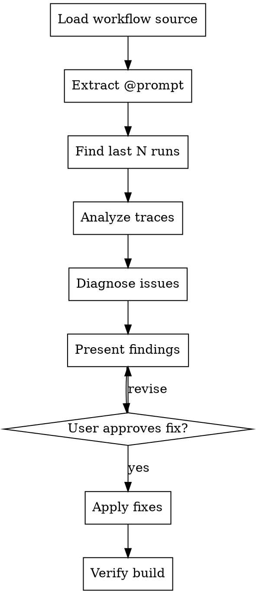

# Improve Workflow

Analyze past audit traces of a workflow to diagnose failures and improve the workflow script.

## Arguments

```
/improve-workflow {workflow-name} [--runs N]
```

- `workflow-name`: filename without `.ts` extension (e.g., `example`, `yahoo-finance-stocks`)
- `--runs N`: number of recent runs to analyze (default: 2)

## Process



### Step 1: Load Context

1. Read `workflows/{workflow-name}.ts`
2. Extract the `@prompt` tag from the top comment — this is the user's original intent
3. List available runs:
   ```bash
   ls -d ~/.cdp-custodial-access/runs/{workflow-name}/*/* 2>/dev/null | sort -r | head -N
   ```

### Step 2: Analyze Traces

For each of the last N runs, read:

1. **`traces/trace.json`** — the full audit trail with every step's tool name, params, result, timing, and page state. Also contains a `logs` array with timestamped workflow and browser console entries.
2. **`metadata.json`** — run-level info (duration, success, timestamps)
3. **Screenshots** (`traces/step-*.png`) — visual state at key steps. Read the screenshots to see what the page looked like.
4. **HTML snapshots** (`traces/step-*.html`) — DOM state. Read selectively when you need to check what selectors would match.
5. **Logs** (inside `trace.json` → `logs[]`) — each entry has `timestamp`, `source` (`workflow` or `browser`), `level` (`info`/`warn`/`error`), and `message`. Browser console errors often reveal JS exceptions or network failures not visible in tool results.

### Step 3: Diagnose

Compare each run against the `@prompt` (intended behavior):

**Per-step analysis:**
- Did the step succeed or fail? (`result.success`)
- If failed, what was the error? (`result.error`, `result.errorCode`)
- What did the page look like at that point? (read the screenshot)
- What selectors were available in the HTML? (read the HTML if selector issues)
- How long did it take? (`durationMs`) — abnormally long steps suggest loading issues
- What do the logs say? Check workflow logs for context on what was attempted, and browser console logs for JS errors, CSP violations, or network failures around the same timestamp

**Cross-run patterns:**
- Do the same steps fail across multiple runs? → systematic issue (wrong selector, site changed)
- Does it fail inconsistently? → timing issue (need longer waits, content not loaded)
- Does step N succeed in one run but fail in another? → race condition or dynamic content

**Common failure categories:**

| Pattern | Diagnosis | Fix |
|---------|-----------|-----|
| `ELEMENT_NOT_FOUND` on same selector across runs | Selector is wrong or site markup changed | Update selectors, add fallbacks |
| `ELEMENT_NOT_FOUND` intermittently | Timing — element not loaded yet | Increase timeout, add `wait()` before |
| `NAVIGATION_FAILED` | Site blocked, URL changed, or network issue | Check URL, try different `waitUntil` |
| Step succeeds but extracts empty/wrong data | Selector matches wrong element, or content is dynamic | Check HTML snapshot, refine selector |
| All steps succeed but output doesn't match `@prompt` | Logic issue — workflow does the wrong thing | Restructure workflow steps |
| Abnormally long `durationMs` on a step | Page is slow to load or element is slow to appear | Increase timeout, add content stabilization |
| Browser console errors around a failing step | JS exception, CSP block, or failed network request on the page | Check if the page's JS is broken or if a required resource was blocked |

### Step 4: Present Findings

Report to the user:

```
## Workflow: {name}
## Original intent: {the @prompt text}

### Runs analyzed: {N}
- Run 1: {date/time} — {PASS/FAIL} ({duration}s, {step count} steps)
- Run 2: {date/time} — {PASS/FAIL} ({duration}s, {step count} steps)

### Issues found:
1. {Issue description} — seen in {N/N runs}
   - Step {X} ({tool}): {what happened}
   - Root cause: {diagnosis}
   - Fix: {proposed change}

2. ...

### Proposed changes to workflows/{name}.ts:
{describe each code change}
```

### Step 5: Apply Fixes

After user approval:
1. Edit `workflows/{workflow-name}.ts`
2. Run `npx tsc --noEmit` to verify
3. Suggest the user run the workflow to test: `npx tsx workflows/{name}.ts --headed`

## Key Principles

- **Read screenshots** — they show what the user would see. A screenshot of a blank page or an error modal tells you more than the trace JSON.
- **Read HTML selectively** — only when you need to check what selectors would match at a specific step. Don't read every HTML file.
- **Cross-reference with @prompt** — the original intent is the ground truth. A workflow that runs without errors but doesn't achieve the prompt's goal is still broken.
- **Fix root causes** — don't just increase timeouts blindly. If a selector is wrong, fix the selector. If the site changed its markup, update the selectors.
- **Preserve working parts** — if steps 1-5 work fine and step 6 fails, don't rewrite the whole workflow.
